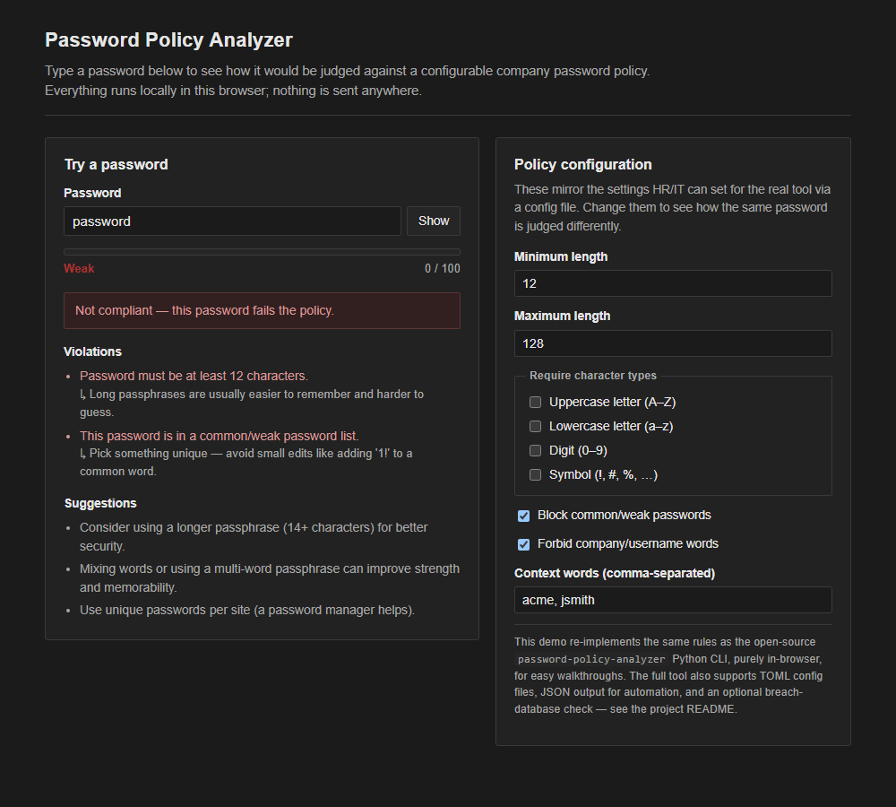
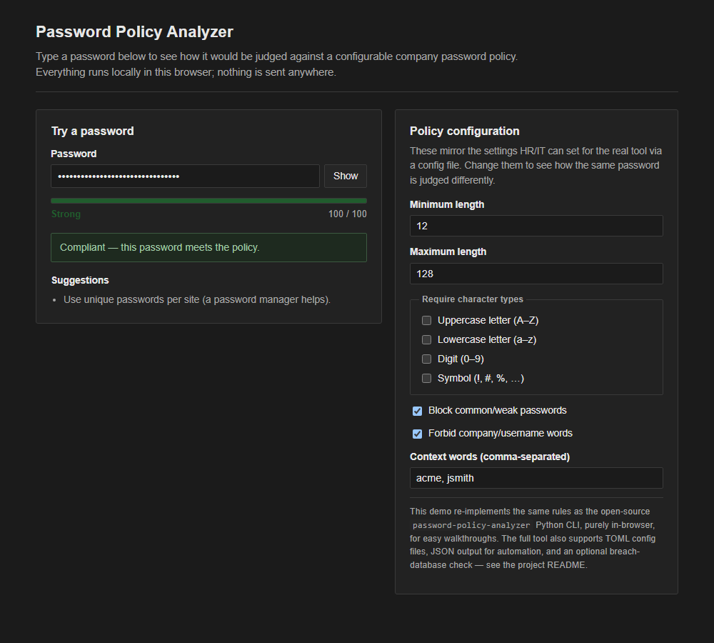

# Password Policy Analyzer

A tool that checks whether a password is strong enough, and whether it meets your
company's password rules — with clear, plain-English feedback on what's wrong and how to
fix it.

---

## What this tool does

When someone sets or changes a password, this tool answers two questions:

1. **Does it follow the company policy?** (long enough, contains required character types,
   doesn't contain the person's name/username/company name, isn't a commonly used weak
   password)
2. **How strong is it, really?** — a 0–100 score and a Weak / Fair / Good / Strong rating,
   independent of whether it technically passes the policy.

It's built around one idea: **modern password guidance favors long passphrases over
complicated character rules.** Instead of forcing "1 uppercase, 1 number, 1 symbol" (which
tends to produce passwords like `Summer2024!` that are easy to guess), it defaults to a
length-first policy and blocks known-weak passwords outright. Every rule is configurable, so
it can also represent a stricter, legacy-style policy if that's what your organization
requires.

---

## Try it yourself (no install needed)

Open [`web/index.html`](web/index.html) in any browser — double-click the file, or drag it
into a browser window. Type a password and the result updates instantly. Everything runs
locally in your browser; nothing you type is sent anywhere or saved.

The policy panel on the right lets you change the rules on the fly (minimum length,
required character types, blocklist, forbidden words) to see how the same password is
judged differently under different company policies.

**Example: a common weak password**



**Example: a compliant passphrase**



> The browser demo mirrors the rules of the full command-line tool for easy walkthroughs.
> The command-line tool (below) is the version intended for real use — e.g. wired into an
> account-creation or password-change flow.

---

## Why this matters

- Weak and reused passwords are one of the most common ways company accounts get
  compromised.
- Rejecting weak passwords *at the moment they're created* is far cheaper than dealing with
  a compromised account afterward.
- A configurable policy means the same tool can enforce whatever rules your organization
  has actually decided on, rather than a fixed one-size-fits-all check.
- Clear, specific feedback ("too short", "too common", "contains your name") reduces
  frustration compared to a generic "password rejected" message.

---

## Features

- Minimum and maximum length checks
- Optional character requirements (upper / lower / digit / symbol) — off by default, since
  length matters more
- A 0–100 strength score and Weak/Fair/Good/Strong rating, separate from pass/fail
- Detects weak/common passwords using a local blocklist
- Optional breach check via the Have I Been Pwned API (k-anonymity, no full password ever
  leaves the machine)
- Context checks (blocks passwords containing the username, company name, etc.)
- Clear violation messages plus practical suggestions
- TOML-based policy configuration, so IT/security can define the rules once and reuse them
- JSON output mode for wiring into other tools or CI pipelines
- A self-contained browser demo for walkthroughs with non-technical stakeholders

---

## Project structure

```text
sec-password-policy-analyzer/
├─ password_policy_analyzer/     # the CLI tool
│  ├─ __init__.py
│  ├─ __main__.py
│  ├─ cli.py                     # argument parsing, text/JSON output
│  ├─ analyzer.py                # rule checks + strength scoring
│  ├─ policy.py                  # policy definition, default policies
│  ├─ config.py                  # TOML config loading
│  └─ weak_passwords.py          # blocklist + HIBP breach check
├─ web/                          # browser-based demo (no install, no build step)
│  ├─ index.html
│  ├─ styles.css
│  └─ app.js
├─ docs/screenshots/             # screenshots used in this README
├─ data/
│  └─ common_passwords_sample.txt
├─ examples/
│  └─ policy.example.toml
└─ tests/
```

---

## Installation

### Option A: Run locally (editable install)
```bash
pip install -e .
```

Then run:
```bash
password-policy-analyzer
```

### Option B: Run as a module (no script required)
```bash
python -m password_policy_analyzer
```

---

## Usage

### 1) Default policy (length-first)
```bash
password-policy-analyzer
```
> The tool will prompt for a password using hidden input (won't show what you type).

### 2) Use a config file (TOML)
```bash
password-policy-analyzer --config examples/policy.example.toml
```

### 3) Forbid context words (username, company, etc.)
```bash
password-policy-analyzer --config examples/policy.example.toml --context jsmith --context acme
```

### 4) Read password from stdin (use carefully)
```bash
echo "SomePasswordHere" | password-policy-analyzer --password-stdin
```
> Warning: stdin/password piping can leak secrets in shell history/logs. Use only for testing.

### 5) JSON output (for automation / CI)
```bash
password-policy-analyzer --password-stdin --format json <<< "Correct Horse Battery Staple"
```

---

## Example output

If the password fails:
```text
Strength: Weak (10/100)

❌ Password is NOT compliant.

Violations:
- [length_too_short] Password must be at least 12 characters.
    ↳ Long passphrases are usually easier to remember and harder to guess.

Suggestions:
- Consider using a longer passphrase (14+ characters) for better security.
- Use unique passwords per site (a password manager helps).
```

If it passes:
```text
Strength: Strong (80/100)

✅ Password is compliant with the policy.
```

JSON output looks like:
```json
{
  "is_compliant": true,
  "score": 80,
  "rating": "Strong",
  "violations": [],
  "suggestions": ["Use unique passwords per site (a password manager helps)."]
}
```

---

## Configuration

Example: `examples/policy.example.toml`
```toml
[policy]
min_length = 12
max_length = 128

require_upper = false
require_lower = false
require_digit = false
require_symbol = false

allow_spaces = true
allow_unicode = true
normalize_unicode_nfc = false

local_blocklist_path = "data/common_passwords_sample.txt"
check_pwned_passwords = false

forbid_context_words = true
```

### Notes
- Composition rules are optional and disabled by default (many modern policies prefer length
  + blocklist over forced character mixes).
- The blocklist sample is intentionally small; swap it for a larger list in a real deployment.

---

## Exit codes

Designed for automation / CI:

- `0` — password is compliant
- `2` — at least one policy violation found

---

## Tests

```bash
pip install pytest
pytest
```

---

## Limitations

- This tool does not manage users, login sessions, hashing, or authentication storage — it
  only evaluates a candidate password against a policy.
- The breach check depends on network availability and is optional (off by default).
- Detection rules are intentionally transparent for learning purposes, not hardened against
  an adversary probing the rules themselves.

---

## Development

```bash
pip install -e . pytest pytest-cov ruff
ruff check .
ruff format .
pytest --cov=password_policy_analyzer --cov-report=term-missing
```

---

## License

MIT — see [LICENSE](LICENSE).
